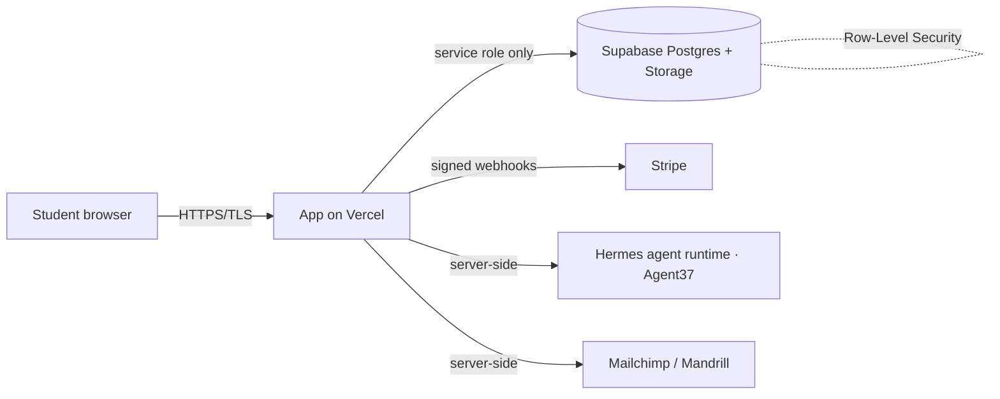

# Vendor Security Packet — The College Agent

**Vendor:** Apollo Claw · **Product:** The College Agent (thecollegeagent.ai) · **Updated:** 2026-07-14
**Security contact:** security@apolloclaw.ai

The single document to send a school's IT/procurement office. It answers the questions institutions
ask before approving a vendor that handles student data, and points to the supporting documents.

## 1. Overview
The College Agent is a personal AI assistant for college students, operated by Apollo Claw. Students
(or an institution on their behalf) provide academic and profile information used solely to deliver
the service. We do not sell or share personal data.

## 2. Where data lives (hosting & data location)
All data is processed and stored in the **United States**.

| Layer | Provider | Region |
|---|---|---|
| Application hosting | Vercel | United States |
| Database, auth, file storage | Supabase (PostgreSQL) | US East (us-east-1) |
| Payments | Stripe | United States |

## 3. Sub-processors
Each sub-processor is a reputable provider with its own security program (most hold SOC 2 / ISO 27001).

| Sub-processor | Purpose | Data it touches |
|---|---|---|
| Vercel | Application hosting / CDN | Traffic; no direct DB access |
| Supabase | Database, authentication, file storage | Student profile, academic intake, files |
| Stripe | Payment processing | Billing details (card data handled entirely by Stripe) |
| Agent37 (Hermes agent runtime) | AI agent runtime platform | Agent configuration and conversation content |
| Mailchimp / Mandrill | Email (marketing / transactional) | Email address, name |

The agent-runtime platform (Agent37) maintains its own current sub-processor list, security
posture, and policies in its Trust Center: **agent37.trust.site**. We give notice before adding a
sub-processor that handles education records. *Contractual advance-change notification at the
runtime layer requires an Agent37 enterprise DPA (not part of the current plan).*

## 4. Data flow (summary)

Students reach only their own data (enforced by row-level security). Privileged operations run
server-side with a service role; the public browser key has no table access.

## 5. Security controls (summary)
- **Encryption:** TLS in transit (HSTS); encryption at rest at both layers — the application database (Supabase managed encryption) and the agent-runtime volumes (Agent37, LUKS2 full-volume encryption); backups encrypted at rest. Student-supplied model API keys are additionally AES-256-GCM encrypted with a key held outside the database.
- **Access control:** per-user data isolation (row-level security, verified on all tables); server-side admin allowlist on every admin route.
- **Application security:** HTTP security headers + Content-Security-Policy; per-IP rate limiting on public endpoints; signature-verified, idempotent payment webhooks.
- **Secrets:** server-side only; verified absent from source; commit-time secret scanning.
- **Vulnerability management:** automated dependency updates + secret scanning.
- **Data rights:** self-service export today; full admin-triggered deletion with a written runbook.

## 6. Documents available on request
- HECVAT responses (`HECVAT-responses.md`)
- Information Security Policy, Incident Response Plan, Data Retention & Deletion Policy
- FERPA-aware Data Processing Agreement (`data-processing-agreement-TEMPLATE.md`)
- Security Hardening Report & Security Posture Briefing

## 7. Vendor-approval readiness — status

**Completed ✅**
- [x] HECVAT questionnaire — pre-filled and ready to submit
- [x] Written security policies (InfoSec, Incident Response, Data Retention)
- [x] Incident response + breach-notification commitment
- [x] Data deletion capability + runbook
- [x] Encryption in transit and at rest
- [x] Per-user access isolation (row-level security) — verified live
- [x] Application hardening (headers, CSP, rate limiting)
- [x] Payment security (Stripe; PCI DSS SAQ-A scope)
- [x] Secrets management + secret scanning + dependency scanning
- [x] Published privacy policy
- [x] Data-flow, sub-processor list, data-location (this document)
- [x] FERPA Data Processing Agreement — **drafted** (pending attorney review)

**In progress / to procure ⬜** *(and who does it)*
- [x] MFA on administrative/infrastructure accounts (Supabase, Vercel, GitHub, Stripe, email) — **done**
- [x] GitHub Dependabot alerts + secret scanning — **done**
- [ ] FERPA DPA attorney review — *you (privacy attorney)*
- [ ] **Cyber liability insurance** — *you (buy a policy; commonly required by procurement)*
- [x] Audit logging of admin & data-access events — **done**
- [x] Cookie/consent banner (GDPR/CCPA) — **done** (consent-gated analytics)
- [ ] Enforced in-app admin MFA (TOTP on the /admin console) — *can be implemented (optional; infra accounts already MFA-protected)*
- [ ] Accessibility conformance (WCAG 2.1 AA / VPAT) — *separate effort; some schools require it*
- [~] **SOC 2** — *agent-runtime platform (Agent37) in progress; Type 1 available on request via Trust Center. Apollo Claw's own attestation on the roadmap.*
- [ ] Third-party penetration test — *procure, typically annual*

## 8. Compliance posture
- **FERPA:** we act as a "school official" under the institution's direct control and will execute a DPA. Apollo Claw executes a FERPA-aware DPA with the institution; the agent-runtime subprocessor (Agent37) operates under its standard terms and Trust Center, so custom flow-down / notification terms at the runtime layer require an Agent37 enterprise agreement.
- **PCI DSS:** minimal scope (SAQ-A) — card data handled entirely by Stripe.
- **GDPR / CCPA:** privacy policy and deletion in place; cookie/consent banner shipped (consent-gated analytics).
- **SOC 2 / ISO 27001:** the agent-runtime platform (Agent37) is undergoing SOC 2; a **Type 1 report is available on request** through its Trust Center (agent37.trust.site). Apollo Claw's own attestation is on the roadmap.
- **Uptime SLA / status page:** no contractual uptime SLA or public status page under the current plan; operational metrics and infrastructure/service logs are monitored (Grafana) at the runtime layer. A contractual SLA is available via an Agent37 enterprise agreement.

*This is a technical summary, not legal advice. The DPA and privacy commitments should be reviewed
by a qualified privacy attorney; SOC 2 requires an independent auditor.*
